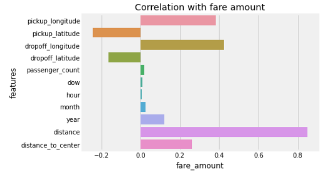
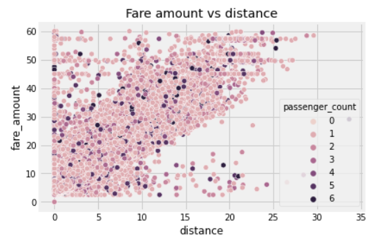
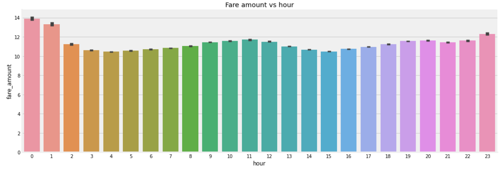
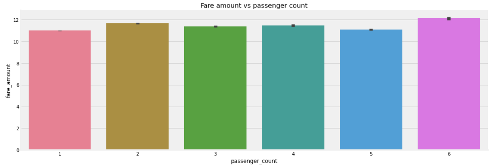

# Taxi Fare Predictor (New York City)
- Objective: The objective of this project is to predict the taxi fare for a taxi ride in New York City given the pickup and dropoff locations.
- Data source: [Kaggle](https://www.kaggle.com/competitions/new-york-city-taxi-fare-prediction/overview)
  - The dataset contains 7 columns, namely pickup and dropoff latitudes and longitudes, passenger count, datetime, and fare amount
- Type of analysis: Regression
- Key models used: Random Forest Regressor
- Key packages used: Scikit-learn

## Step 1 - preprocessing and feature engineering
After performing data exploration to identify outliers, observe data distributions etc, the dataset was cleaned (e.g. removing rows with invalid lat/lng coordinates, missing values). Thereafter, feature engineering was performed to:
  1. extract time features from the datetime, such as the hour and day of week
  2. calculate distance features from the coordinates, such as haversine distance and distance to/from NYC center

As expected, the distance between the pickup and dropoff locations is the most important determinant of taxi fare, with a good correlation of R^2 = 0.85.

On the other hand, while the hour of the day appears to have no correlation with the fare amount, there seems to be a cyclical pattern as observed in the graph below, with fare amount peaking at around midnight and noon, the former due to midnight surcharges.

It appears that there is no clear trend between passenger count and fare amount, and this is expected since taxi fares in New York are based on meters and not the passenger count.

(*Note: because we are using the free tier of Heroku, the Heroku dynos become idle when the website is not used for a while. Hence when loading the webpage for the first time, it takes about 30-60 seconds for the dynos to restart and get the page to load. Subsequent refreshes of the webpage will be much faster.*)
