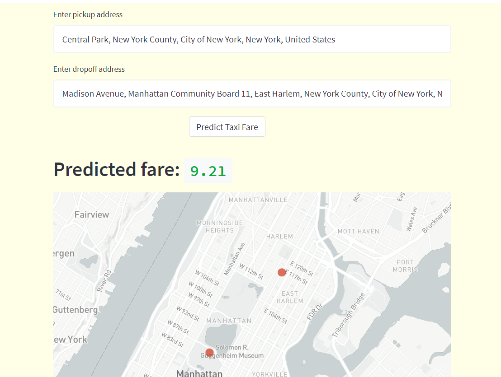

# Taxi Fare Predictor (New York City)
- Objective: To predict the taxi fare for a taxi ride in New York City given the pickup and dropoff locations, date, time and passenger count
- Data source: [Kaggle](https://www.kaggle.com/competitions/new-york-city-taxi-fare-prediction/overview)
  - The dataset contains 7 columns, namely pickup and dropoff latitudes and longitudes, passenger count, datetime, and fare amount
- Type of analysis: Regression
- Key models used: Random Forest Regressor
- Key packages used: Scikit-learn

## Step 1 - Preprocessing and feature engineering
After performing data exploration to identify outliers, observe data distributions etc, the dataset was cleaned (e.g. removing rows with invalid lat/lng coordinates, missing values). Thereafter, feature engineering was performed to:
  1. extract time features from the datetime, such as the hour and day of week
  2. calculate distance features from the coordinates, such as haversine distance and distance to/from NYC center

As expected, the distance between the pickup and dropoff locations is the most important determinant of taxi fare, with a good correlation of R2 = 0.85.

On the other hand, while the hour of the day appears to have no correlation with the fare amount, there seems to be a cyclical pattern as observed in the graph below, with fare amount peaking at around midnight and noon, the former due to midnight surcharges.

It appears that there is no clear trend between passenger count and fare amount, and this is expected since taxi fares in New York are based on meters and not the passenger count.

## Step 2 - Model training
A pipeline was first built to include preprocessing methods such as scaling the dataset and one hot encoding categorical features. Different regression models such as support vector machines, lasso regressors were tested out, each of these models using their default hyperparameters. The **random forest regressor** model came out on top, with an **RMSE score of 3.1**, while the other models had RMSE scores of around 4 to 5 on average. Thereafter, a random search was performed, followed by a grid search, to fine-tune and optimise the hyperparameters. The final random forest regressor model had an RMSE score of xx (TBU).

The full dataset contains around 55 million rows; in order to be able to train the model locally, only 1 million rows were used.

## Step 3 - Model deployment
The model and relevant code were packaged into a web application using **Streamlit**, and deployed using **Heroku**.The link to the web application is as follows: [https://taxifare-marcus.herokuapp.com/](https://taxifare-marcus.herokuapp.com/)

(*Note: because we are using the free tier of Heroku, the Heroku dynos become idle when the website is not used for a while. Hence when loading the webpage for the first time, it takes about 30-60 seconds for the dynos to restart and get the page to load. Subsequent refreshes of the webpage will be much faster.*)

In the webpage, the user is prompted to enter the date, time, number of passengers, pickup and dropoff addresses. If the address entered is ambiguous, a prompt will appear with some suggested addresses. If an invalid address is entered, an error will pop out as well.

After the user has filled in the boxes with valid addresses and clicks the button "Predict Taxi Fare", the map refreshes, displaying the entered locations on the map as two red dots, and the predicted fare appears above the map as well.

## Future improvements
- To train the model on the full dataset, using a cloud provider such as Google Cloud Platform
- Perform further feature engineering such as calculating Manhattan or Euclidian distance, using Geohash
